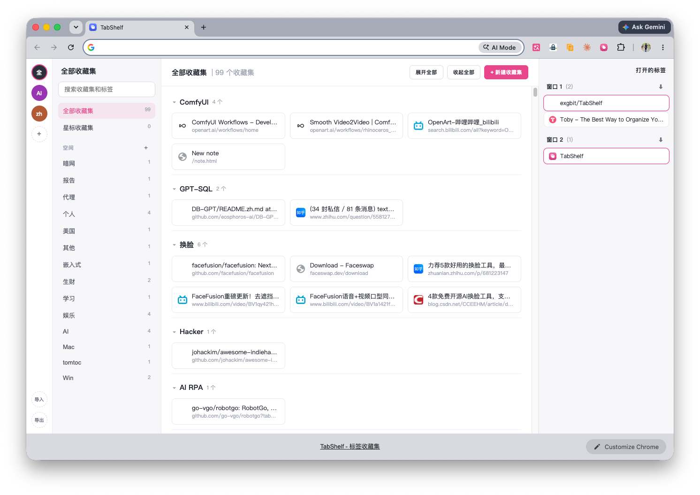

# TabShelf - 标签收藏集

免费开源的 Toby 替代品：保存/恢复标签组、新标签页工作台、全局搜索。数据纯本地，支持导出/导入 JSON 跨设备迁移。

## 背景

Toby 转为付费后就没再继续用了，自己动手做了这个免费开源版本，覆盖它最核心的几个能力：保存/恢复标签组、新标签页工作台、全局搜索。

项目主体代码由 [Kimi K3](https://www.kimi.com/) 开发，也算是拿这个真实需求测试了一下它的编码能力，效果还不错。

## 安装

1. 打开 Chrome，访问 `chrome://extensions`
2. 打开右上角「开发者模式」
3. 点击「加载已解压的扩展程序」，选择本目录
4. 新标签页即变为工作台；点击工具栏图标可保存当前窗口标签

## 功能

- **Toby 风格四栏工作台**：组织图标栏 → 空间面板 → 收藏集卡片区 → OPEN TABS 实时窗口标签列表
- **保存标签组**：点击扩展图标保存单个标签/整个窗口，或工作台右栏 OPEN TABS 中每个窗口的保存按钮一键存为收藏集
- **恢复**：收藏集分区头部「打开全部」在新窗口恢复整组，或点击单个卡片打开
- **组织/空间**：收藏集带两级归属，左栏按组织、空间筛选；空间自动从收藏集归属中派生
- **收藏集管理**：重命名、删除、移动到空间、复制收藏集、复制全部链接到剪贴板、星标置顶、单个折叠或一键展开/收起全部
- **单个标签管理**：单独打开、删除
- **搜索**：工作台顶部搜索框支持快捷键 `/` 聚焦、`Esc` 清空，同时过滤已保存卡片和当前打开的标签；弹窗内搜索框过滤空间和收藏集
- **导出/导入**：JSON 格式，导入时可选择合并或覆盖；支持直接导入 Toby 官方导出的 JSON（保留组织/空间层级）

## 数据与隐私

所有数据仅保存在浏览器本地（`chrome.storage.local`），不联网、不上传、不收集任何数据。跨设备迁移通过导出/导入 JSON 文件完成。

## 已知限制

拖拽排序、手动添加链接暂未实现，见 [REQUIREMENTS.md](REQUIREMENTS.md) 里程碑 M2。

## 文件结构

- `manifest.json` — Chrome MV3 配置
- `popup.html/js/css` — 工具栏弹窗（保存标签）
- `newtab.html/js/css` — 新标签页工作台（浏览/搜索/导入导出）
- `storage.js` — 数据层（chrome.storage.local）
- `REQUIREMENTS.md` — 需求文档

需求与设计决策见 [REQUIREMENTS.md](REQUIREMENTS.md)。
